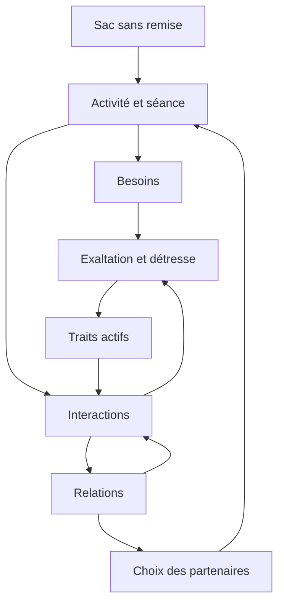

# Plan de conception V7 — Personnages et relations

> Document de conception conservé. La réalisation 0.7.0 adopte les arbitrages des [DDD actuels](./gdd/documentation.md). Le mandat final autorise des raccords débranchés s’ils sont explicites et ne cassent pas le jeu; leur [registre](./gdd/raccords-v7.md) remplace l’objectif idéal d’absence de débranchement ci-dessous. Les propositions et cases de vérification de ce plan ne sont pas un état de livraison.

La V7 est le jalon **personnages et relations** de Garage vivant. Elle remplace les décisions opaques par un sac d’actions qui s’épuise, relie les besoins à deux jauges émotionnelles et fait émerger les comportements à travers les traits, les activités et les relations.

**Objectif de livraison : une simulation compréhensible et jouable où aucun système conservé ne se retrouve débranché.** Le joueur doit pouvoir voir ce qui se passe, pourquoi, et quels paramètres ont pesé dans le résultat.

Ce plan consolide les décisions de la conversation de conception. Il ne constitue pas un nouvel audit du dépôt ni une description de fonctionnalités déjà livrées. Les constats sur le code rapportés pendant la discussion devront être confirmés au premier lot de travail.

Trois statuts sont utilisés : **retenu** pour les décisions prises ensemble; **proposition de départ** pour les règles minimales permettant d’implémenter et tester; **à résoudre** pour les arbitrages qui restent ouverts. Les dernières décisions remplacent les pistes abandonnées.

## 1 Périmètre de la V7

| Chantier | Traitement V7 |
| --- | --- |
| Sac Rapin | Vrai tirage sans remise, cycles visibles et sacs propres aux personnages. |
| Besoins | Énergie, lien social, plaisir, expression; suppression du confort. |
| Sommeil | Cycle obligatoire distinct des jetons; horaires et durée individuels. |
| Émotions | Exaltation et détresse indépendantes; retrait des six anciennes jauges comme moteur émotionnel. |
| Humeur | Suppression de la valeur globale et de son rôle mécanique; remplacement de ses raccords. |
| Traits | Traits permanents et conditionnels; catalogue explicatif; douzaine de traits de test et Alpha/Bêta. |
| Rencontres et activités | Intentions issues du sac, séances rejoignables, échanges intégrés aux activités. |
| Interactions | Discuter, soutenir, faire une avance; acceptation distincte du résultat. |
| Relations | Affinité durable, tension passagère, lien amoureux orienté; chimie musicale conservée. |
| Groupes | Poids de sélection provisoire lié au développement; pas de refonte de leur progression. |
| Personnalité, déchéance, musique et spectacles | Conservation et adaptation des dépendances nécessaires. |
| Interface, sauvegardes et documentation | Mise à jour complète des éléments touchés. |

**Hors périmètre :** refonte complète des actions et de leurs effets, refonte des six valeurs de personnalité, nouvelle conception de la déchéance, nouveau moteur de composition, refonte des spectacles, attachement individuel complet aux groupes, éditeur de traits et calendrier représentant des mois ou des années.

Les précédentes demandes visuelles sur les spectacles restent un chantier distinct. Elles ne doivent ni disparaître du suivi ni être présentées comme des décisions de cette refonte.

## 2 La boucle de simulation

Le sac détermine l’activité. Les déplacements et la disponibilité déterminent les occasions. Les activités et interactions modifient les besoins, les émotions et les relations. Les jauges émotionnelles activent des traits; les traits modulent les mécanismes qui les consultent. Les relations orientent les prochaines rencontres.

**Précision issue de la dernière décision :** exaltation et détresse interviennent aussi directement dans l’acceptation et le résultat des interactions, avec l’affinité et la tension. Les traits ajoutent leurs modificateurs. La proposition antérieure « les émotions agissent uniquement par les traits » est donc remplacée.

Cette boucle ne permet pas aux besoins ou à la personnalité de repondérer silencieusement les jetons restants.

## 3 Un vrai sac Rapin

**Retenu.** Chaque personnage possède un nombre fini de jetons d’actions. Un jeton pigé est retiré du sac et rejoint les jetons consommés. Lorsque le cycle est terminé, le sac est reconstitué pour le suivant. L’ordre est aléatoire; la composition du cycle est connue.

La taille peut varier fortement entre personnages. Un petit sac revient rapidement à sa répartition complète; un grand sac permet des séquences plus longues et variables. La garantie concerne les actions du cycle, pas nécessairement le temps passé dans chacune si leurs durées diffèrent.

Les besoins ne changent ni la quantité des jetons ni leur probabilité individuelle de sortie. Les anciennes formules de choix par scores ne doivent pas reprendre la main. Les futurs systèmes pourront ajouter ou enlever des jetons, mais seulement par une règle explicite et visible.

**À résoudre avant implémentation :**

- À quel moment précis le jeton est-il considéré comme consommé : pige, début ou fin de l’activité?

- Que devient un jeton dont l’action est temporairement impossible?

- Quand une modification du contenu du sac entre-t-elle en vigueur?

- Que devient l’ancien mode « Meilleur score » : retrait de l’expérience V7 ou maintien comme outil de comparaison clairement séparé?

**Proposition de départ :** réserver le jeton à la pige, le consommer quand l’activité commence. Si aucune cible compatible n’existe après une courte recherche, différer ce jeton sans le compter comme réalisé et essayer un autre jeton admissible. Si aucun ne l’est, attendre un changement de disponibilité plutôt que boucler sans fin. Cette règle devra être validée techniquement et expliquée dans l’interface.

Une modification manuelle s’appliquerait au prochain remplissage par défaut. Toute règle qui modifie le cycle courant doit indiquer si elle touche les jetons restants, la composition future ou les deux. Éviter les remises à zéro implicites qui annuleraient la garantie du cycle.

## 4 Les huit sacs de départ

**Retenu.** Donner aux huit personnages de base des échantillons volontairement contrastés, entre environ 10 et 100 jetons. Il s’agit de matériel d’essai, pas de leur équilibrage définitif.

**Proposition de départ**, à attribuer aux personnages existants après inventaire de leurs profils :

| Profil de test | Décrocher | Socialiser | Pratiquer | Jammer | Composer | Total |
| --- | --- | --- | --- | --- | --- | --- |
| A équilibré court | 2 | 2 | 2 | 2 | 2 | 10 |
| B social | 2 | 7 | 2 | 3 | 1 | 15 |
| C pratique | 3 | 2 | 10 | 3 | 2 | 20 |
| D composition | 4 | 3 | 5 | 5 | 13 | 30 |
| E collectif | 5 | 9 | 5 | 17 | 4 | 40 |
| F pauses fréquentes | 24 | 12 | 10 | 8 | 6 | 60 |
| G solitaire créatif | 10 | 4 | 24 | 8 | 34 | 80 |
| H équilibré long | 20 | 20 | 20 | 20 | 20 | 100 |

A et H servent notamment à comparer deux sacs aux mêmes proportions, mais de tailles différentes.

Cette liste d’actions est une base transitoire issue de la discussion. La refonte complète des actions est reportée. **Récupérer redevient Décrocher. Dormir n’est pas un jeton. Former un groupe sort du sac** et doit devenir une conséquence possible des rencontres ou des activités musicales.

Les conditions précises de proposition et de formation d’un groupe restent un raccord à définir; supprimer le jeton ne doit pas supprimer la possibilité de former un groupe.

## 5 Sommeil et énergie

**Retenu.** Le sommeil est obligatoire et géré hors sac. Chaque personnage possède une durée habituelle de sommeil et une préférence d’horaire. Le sommeil obtenu par rapport à son besoin influence son repos au réveil; les activités font ensuite évoluer son énergie.

Dormir davantage réduit le temps disponible pour les activités. Deux personnages ayant dormi huit heures ne sont pas nécessairement aussi reposés si leurs besoins de sommeil diffèrent.

Quand tout le monde dort, la simulation accélère jusqu’au premier réveil. Cette accélération doit conserver les effets du temps sur les systèmes actifs; elle ne doit pas sauter les évolutions de besoins, émotions ou relations.

**Décrocher** est une pause durant l’éveil. Cette action aide à souffler et ne remplace pas une nuit.

La thématique reste celle d’une journée de 24 heures. L’idée qu’une journée représenterait éventuellement une autre unité de temps est reportée. Les heures évoquées de trois à six heures du matin étaient des exemples, pas un horaire imposé.

**À résoudre :** interruption ou fin d’une activité au coucher, traitement des engagements nocturnes et comportement à énergie nulle. Ne pas réintroduire automatiquement une récupération forcée issue de l’ancien système sans la confronter au nouveau sommeil.

## 6 Quatre besoins et des pressions par paliers

| Besoin conservé | Sens |
| --- | --- |
| Énergie | Réserve physique et fatigue. |
| Lien social | Sentiment de connexion aux autres. |
| Plaisir | Divertissement et satisfaction de s’amuser. |
| Expression | Satisfaction créative et possibilité de s’exprimer. |

**Le confort est retiré.** Supprimer sa jauge, ses effets, ses réglages et ses références dans les formules touchées. Les lieux et leurs autres caractéristiques restent en place; leur éventuel rôle futur ne justifie pas une jauge de confort cachée.

**Retenu.** Les besoins exercent une pression continue sur les émotions selon des paliers propres au personnage :

- Besoin bas : augmentation progressive de la détresse.

- Besoin très bas : pression plus forte.

- Besoin très satisfait : augmentation progressive de l’exaltation.

- Sortir d’une zone arrête sa pression sans effacer l’émotion déjà accumulée.

La décroissance naturelle des émotions continue en parallèle. Les pressions de plusieurs besoins peuvent coexister, y compris sur les deux jauges.

Les seuils 30, 15 et 90 évoqués dans la discussion sont des exemples. Il faut pouvoir voir les seuils personnels et les effets correspondants dans le jeu. Pour un même besoin, une zone plus intense remplace la zone moins intense dans la proposition de départ, afin de ne pas additionner deux fois une pression annoncée comme un seul palier.

Les sources actuelles qui font monter ou descendre les besoins doivent être inventoriées et conservées ou adaptées. Leur refonte détaillée n’entre pas dans ce jalon.

## 7 Deux jauges émotionnelles

**Retenu.** Le moteur émotionnel utilise **exaltation** et **détresse**, indépendantes. Les deux peuvent être hautes en même temps. Elles ne se partagent pas une réserve de 100 %. Le seuil global calculé par addition des émotions est abandonné.

La règle commune combine les pressions durables, les variations ponctuelles et une décroissance naturelle. **Proposition de départ :** chaque jauge reste entre 0 et 100 et décroît vers zéro; les vitesses sont configurables. Aucun équilibre émotionnel personnel n’a été définitivement adopté dans la discussion.

Les événements peuvent produire des variations ponctuelles sur l’une ou les deux jauges. Leurs raccords actuels doivent être repris. La proposition de moduler toutes les réactions aux événements par les traits n’a pas reçu, dans les passages disponibles, une validation aussi explicite que les règles sociales : la traiter comme une règle de raccord à préciser, sans introduire une nouvelle statistique de motivation.

Les six anciennes jauges émotionnelles sont remplacées. Affection et enthousiasme ne deviennent pas automatiquement de nouvelles jauges ailleurs. Leurs fonctions utiles sont redistribuées dans les relations, les traits ou les raccords musicaux.

L’humeur globale est retirée, y compris son utilisation pour les conflits. L’ancien historique peut inspirer une présentation des deux nouvelles courbes; il ne doit pas maintenir une humeur cachée.

Les appellations anciennes comme euphorie ne constituent pas un catalogue validé de sentiments combinés. La V7 n’ajoute pas un second moteur de sentiments par-dessus les deux jauges : son vocabulaire comportemental passe d’abord par les traits activés.

## 8 Traits permanents et conditionnels

**Retenu.** Un catalogue commun décrit des traits ayant des effets mécaniques explicites. Un personnage peut posséder des traits permanents et des associations conditionnelles composées d’un axe, d’un seuil et d’un trait.

Quand la jauge atteint la zone d’activation, le personnage obtient le trait. Quand elle redescend sous le seuil, il le perd. **Proposition de convention :** actif à partir du seuil inclus, inactif en dessous. Plusieurs traits peuvent coexister.

Un seuil ne déclenche pas directement une dispute ou une autre action. Il peut rendre un personnage hargneux, ce qui modifie ses interactions. Si une dispute survient, ses conséquences relationnelles persistent après la disparition du trait.

Les effets associés à la détresse sont généralement défavorables; ceux associés à l’exaltation généralement favorables, avec des exceptions. Une forte détresse pourrait par exemple activer un futur trait de créativité. « Génie créatif » est une idée de contenu, pas une affirmation sur le catalogue actuel.

**Préparation V7 :** concevoir environ douze traits de test, sans chercher un catalogue final. Ajouter aussi **Alpha** et **Bêta** : Alpha favorise la prise d’initiative sociale, Bêta la réduit. Ils sont facultatifs et incompatibles dans la proposition de départ. Leur présence ne garantit jamais l’initiative. Les conflits particuliers entre deux Alphas sont reportés.

**Assignation simple proposée :** à la création, tirer une ou deux associations conditionnelles au total; tirer l’axe, un seuil dans une plage de test et un trait compatible, avec une pondération majoritairement favorable pour l’exaltation et défavorable pour la détresse. Éviter les doublons et les incompatibilités. Conserver ces associations dans la sauvegarde.

Les traits peuvent modifier l’initiative, le choix d’interaction, l’acceptation, le résultat et l’intensité des effets, selon leur définition. Un trait du destinataire peut aussi modifier le comportement des autres envers lui.

La personnalité numérique reste distincte. L’empathie a été citée à la fois comme valeur et comme idée de trait : vérifier le modèle existant et éviter deux bonus identiques appliqués sans explication.

**Précaution technique proposée :** suivre la source d’un trait. Si un trait est permanent ou activé par deux sources, la disparition d’une source ne doit pas retirer les autres. L’éditeur permettant de créer librement des traits viendra plus tard.

## 9 Rencontres et séances rejoignables

**Retenu.** Le sac produit l’intention d’activité. « Socialiser » amène le personnage à chercher une personne ou une discussion accessible, à la rejoindre, puis à proposer un échange. « Jammer » peut amener à rejoindre une jam ouverte.

La proximité fournit une occasion compatible avec l’intention. Elle ne crée pas une activité sociale supplémentaire qui contourne le sac. Les échanges à l’intérieur d’une activité commune appartiennent à cette activité : pas besoin de piger « Socialiser » pendant une jam.

Une séance indique si elle accepte des participants. Les discussions et jams peuvent être ouvertes; le sommeil ne l’est pas. Rejoindre une activité compatible n’oblige pas les participants à interrompre leur activité.

L’indisponibilité n’est pas un refus social. Si rien n’est accessible, le personnage effectue une recherche limitée, puis applique la règle prévue pour les jetons différés.

L’arrivée ne confère pas le rôle de meneur pour toute la séance. **Les occasions d’échange sont cadencées par la séance**, plutôt que par chacun de ses membres. À chaque occasion, un initiateur est tiré parmi les participants admissibles, avec des poids modifiés par ses traits.

**Raccords à préciser :** portée physique, capacité éventuelle des séances, admission d’un nouveau membre, temps passé par chaque participant, départs et dissolution d’une séance. Éviter qu’un groupe plus gros multiplie involontairement les interactions à chaque tick.

## 10 Choisir qui rejoindre

**Retenu.** Un tirage pondéré sélectionne la personne ou la séance :

- Une chance de base maintient la possibilité de rencontrer des inconnus.

- L’affinité favorise le rapprochement.

- La tension le freine.

- Les traits personnels et relationnels peuvent modifier ces poids.

- L’appartenance au même groupe ajoute un poids important pour les activités pertinentes.

Pour une séance collective, la moyenne des relations avec les participants est la base simple retenue. La chimie musicale ne pondère pas directement ce choix dans un premier temps; elle peut renforcer les gains d’affinité lors de bons moments musicaux.

Le bonus de groupe doit généralement peser fortement, sans rendre impossible un choix extérieur. Une relation personnelle exceptionnelle peut rester déterminante.

**Raccord provisoire retenu :** brancher ce bonus sur le développement du groupe, avec le même mécanisme pour ses membres. L’attachement individuel à chaque groupe viendra plus tard.

La conversation a identifié le développement puis l’a assimilé à la coordination affichée. **Ce lien entre les deux noms doit être vérifié dans le code avant de choisir le champ à utiliser.** Harmoniser ensuite l’interface et la documentation. Vérifier aussi le traitement des personnages appartenant à plusieurs groupes.

Les traits relationnels comme « Inséparables » doivent être attachés à une relation ciblée, et non transformer un personnage en meilleur ami de tout le monde. Ils rendent certains choix plus probables sans les imposer. Leur seuil exact et leur catalogue restent à préparer.

## 11 Le déroulement commun des interactions

**Retenu.** Toutes les interactions utilisent le même squelette :

1. Vérifier le contexte et les participants admissibles.

2. Déterminer l’initiateur.

3. Choisir le destinataire, sauf s’il était déjà ciblé par l’approche.

4. Choisir une interaction permise dans cette situation.

5. Résoudre l’acceptation ou le refus du destinataire.

6. En cas d’acceptation, résoudre un résultat favorable, neutre ou défavorable.

7. Appliquer et expliquer les conséquences pour chaque personnage et chaque relation orientée.

Un refus met fin à cette tentative. On ne tire pas ensuite un résultat d’échange. Pour le prototype, il peut produire une petite hausse de détresse chez l’initiateur; aucune grosse sanction automatique n’est retenue.

**Base de calcul retenue :** affinité, tension, exaltation et détresse, puis modificateurs de traits. Pour l’acceptation, prendre le point de vue du destinataire; le résultat peut tenir compte des deux participants. Les paramètres exacts restent à régler.

Le statut « membre d’une jam » n’implique pas d’accepter toutes les sollicitations. Une issue favorable signifie que l’interaction est bien reçue, pas nécessairement que toutes les jauges montent.

Une dispute émerge d’un échange et de son résultat. Elle n’est ni imposée par un seuil émotionnel ni ajoutée comme activité indépendante du sac.

## 12 Le catalogue social minimal

| Interaction | Fonction V7 | Conditions et nuances |
| --- | --- | --- |
| Discuter | Interaction ordinaire; nourrit le lien social et fait évoluer modestement la relation. | Peut être acceptée ou refusée, puis bien ou mal se passer. Un résultat positif peut réduire la tension. |
| Soutenir | Cherche principalement à réduire la détresse du destinataire. | Peut être sans effet ou, plus rarement, aggraver la situation. Les caractéristiques du personnage peuvent favoriser l’initiative et la qualité du soutien, ou les freiner. |
| Faire une avance | Développe le lien amoureux. | Devient admissible à partir d’un lien suffisant. Accepter un flirt ne signifie pas être en couple. |

Les amplitudes restent des paramètres de test. Les effets sur les deux personnages ne doivent pas être automatiquement identiques.

**Mis en réserve :** proposer une idée et critiquer comme interactions distinctes. Une idée ou un désaccord peuvent habiller un échange dans une activité musicale, sans nouvelle mécanique dédiée.

**S’excuser est reporté.** La tension seule ne doit pas produire des excuses systématiques. Une future condition particulière ou un trait pourra rendre cette interaction possible. En V7, les bons échanges et l’apaisement naturel permettent déjà de réduire la tension.

La liste initiale de six interactions n’a donc pas été validée comme catalogue final.

## 13 Affinité et tension

**Retenu.** Les relations sont orientées : ce que A ressent envers B peut différer de ce que B ressent envers A.

**L’affinité est le lien durable.** Elle monte et descend lentement. **La tension est la friction du moment.** Elle peut monter rapidement, même entre personnages qui s’apprécient beaucoup.

La tension redescend naturellement plus vite quand l’affinité est forte. Une tension qui demeure élevée érode lentement l’affinité. Les interactions positives peuvent aussi apaiser la tension.

Une dispute brève a un effet limité sur une amitié solide; une tension persistante finit par l’endommager. Il ne s’agit pas de jauges inverses, ni d’un transfert automatique point pour point. Le ratio dix pour un évoqué était une illustration, pas une constante adoptée.

Conserver une possibilité d’échange positif même quand la tension est élevée, pour éviter une spirale dont personne ne peut sortir. La fréquence, la durée et l’intensité des mauvaises expériences doivent néanmoins pouvoir faire évoluer durablement une relation.

Les seuils relationnels pourront activer des traits ciblés. Ces traits complètent les effets directs de l’affinité et de la tension; ils ne les remplacent pas.

## 14 Lien amoureux et couples

**Retenu.** Unifier les fonctions utiles de l’attirance et de l’amour vécu dans une jauge appelée **lien amoureux**, sans jauge d’attirance parallèle. Le lien est orienté et distinct de l’affinité amicale et de la chimie musicale.

Le démarrage doit rester rare. Un échange positif ordinaire a une petite chance de faire naître les premiers points de lien; les traits modulent cette chance. La plupart des échanges restent amicaux. Éviter que la simple répétition fasse mécaniquement tomber tout le monde amoureux de tout le monde.

À partir d’un seuil de lien, « Faire une avance » devient une interaction possible. Elle peut être refusée, acceptée sans suite ou faire progresser le lien. Aucun gain n’implique automatiquement la réciprocité.

Un trait porté par le destinataire peut augmenter le poids des avances parmi les interactions admissibles. Il ne contourne pas le seuil, ne garantit pas l’acceptation et ne force pas l’amour.

Le statut **en couple** est distinct de la jauge. Quand les deux liens dépassent le seuil requis, une mise en couple devient possible. Si le lien de l’un retombe sous un seuil inférieur, une rupture devient possible. Les deux seuils sont différents pour éviter les ruptures et remises en couple provoquées par de petites fluctuations.

Les seuils, probabilités, vitesses d’érosion et restrictions éventuelles du modèle existant restent à régler ou à préserver après inventaire. Les idées de « complicité amoureuse » servent le sens du lien; elles ne justifient pas une jauge supplémentaire.

## 15 Tous les systèmes conservés doivent rester raccordés

Avant toute suppression, établir une correspondance vérifiée entre chaque ancienne dépendance et sa destination V7.

| Système | Travail de raccord requis |
| --- | --- |
| Choix d’actions | Remplacer les scores et probabilités avec remise par le sac fini; empêcher les choix concurrents cachés. |
| Personnalité | Conserver les valeurs et leurs effets utiles; vérifier chaque influence sur les décisions, durées, réactions et émotions. |
| Besoins | Conserver leurs sources et dépenses; retirer le confort sans le transférer implicitement ailleurs. |
| Conflits | Remplacer les dépendances à l’humeur par les nouvelles règles d’acceptation, de résultat et de traits. |
| Souvenirs | Repérer leurs effets actuels, particulièrement ceux qui alimentent l’humeur; préserver leur rôle utile par un raccord explicite à définir. |
| Déchéance | Préserver les états, conséquences et possibilités de sortie existants; remplacer les entrées devenues obsolètes. |
| Composition et chansons | Préserver création, progression et qualité; remplacer les lectures des anciennes émotions sans supprimer la diversité musicale. |
| Chimie et complicité musicales | Identifier leurs rôles actuels avant toute fusion; conserver les différences utiles et le lien aux bonnes expériences communes. |
| Groupes | Maintenir formation, répétitions, développement, statuts et disparition éventuelle; remplacer le jeton de formation par un déclencheur social ou musical. |
| Spectacles | Maintenir lancement, déroulement, récompenses, progression et conséquences sur les personnages. |
| Sommeil et horloge | Raccorder horaires, accélération et progression de tous les effets temporels. |
| Sauvegardes | Versionner, migrer les données supprimées ou remplacées et préserver les personnages, relations et productions. |
| Outils de réglage | Remplacer les commandes devenues obsolètes; faire modifier l’état réellement utilisé par le moteur. |
| Interface et documentation | Afficher les noms, règles et valeurs réellement utilisés en V7. |

**Règle de réalisation :** pour chaque raccord, noter la source actuelle, le consommateur, la destination proposée, la décision nécessaire et le scénario de vérification. Un système n’est pas conservé simplement parce que son écran existe encore.

La composition exige une attention particulière : deux intensités ne codent plus les nuances des six émotions précédentes. Ne pas prétendre qu’une conversion numérique évidente préserve à elle seule les tonalités. Préparer le raccord minimal, rendre ses limites explicites et ne pas démarrer une refonte musicale entière.

Ne pas réintroduire une humeur cachée sous un autre nom pour faciliter les anciens calculs. Ne pas inventer de nouvelles valeurs de personnalité pour remplir les trous. Si un raccord demande une vraie décision de design, le relever avec une proposition précise.

## 16 Voir la machine dans le jeu

La transparence fait partie du gameplay de la V7. Les informations nécessaires à une décision doivent être accessibles depuis le personnage, la relation ou la séance concernée.

| Vue | Informations à rendre accessibles |
| --- | --- |
| Sac personnel | Composition du cycle, jetons restants, consommés et réservés ou différés, numéro de cycle, règle de remplissage et modifications prévues. |
| Besoins | Valeur actuelle, seuils personnels, zone active, pression produite et sources de variation. |
| Émotions | Exaltation et détresse, évolution dans le temps, contributions actives et décroissance. |
| Seuils émotionnels | Traits attendus, seuils exacts, traits actifs et condition de retrait. |
| Catalogue des traits | Tous les traits disponibles, effets concrets, conditions, incompatibilités et systèmes affectés. Recherche par nom, notamment les traits existants comme Solitaire. |
| Relation | Affinité, tension et lien amoureux dans les deux directions; traits ciblés; données musicales pertinentes. |
| Séance | Activité, membres, ouverture aux nouveaux participants, prochain échange et personnes admissibles. |
| Explication sociale | Initiateur, destinataire, interaction, acceptation ou refus, résultat et conséquences. |
| Détail du tirage | Chances de base, modificateurs, chances finales et résultat obtenu. |
| Groupe | Jauge réellement utilisée pour le bonus de groupe, intitulé cohérent et poids appliqué. |

Le joueur doit pouvoir répondre à trois questions : **Pourquoi a-t-il fait ça? Qu’est-ce qui a changé? Qu’est-ce qui pourrait se produire ensuite?**

La vue d’ensemble reste lisible; les détails se déploient à la demande. Ne pas couvrir les informations importantes avec des panneaux, ne pas imposer des allers-retours entre des contrôles éloignés. Les explications doivent provenir des mêmes données que les calculs.

L’ancien graphique de l’humeur est remplacé par une présentation utile des nouvelles jauges. La durée exacte de l’historique est un paramètre d’interface à confirmer, pas une règle émotionnelle.

## 17 Ordre de réalisation

| Lot | Travail | Condition de sortie |
| --- | --- | --- |
| 0 Audit et référence | Lire le code et le wiki, inventorier données et consommateurs, capturer une sauvegarde de référence et les comportements à préserver. | Carte des raccords complète; contradictions de vocabulaire résolues; décisions manquantes isolées. |
| 1 Modèle de données | Préparer sacs finis, deux jauges, seuils, sources de traits, relations et version des sauvegardes. | Modèle cohérent et stratégie de migration définie avant suppression des anciens champs. |
| 2 Sac et rythme quotidien | Implémenter les cycles, les cas impossibles, Décrocher, le sommeil et les huit sacs de test. | Les cycles consomment réellement les jetons; la simulation avance sans blocage. |
| 3 Besoins et émotions | Retirer confort et humeur; brancher pressions, variations et décroissance; préparer les traits de test. | Chaque évolution est explicable; activation et retrait corrects des traits. |
| 4 Séances et partenaires | Ajouter les activités rejoignables, le rythme social par séance, les poids relationnels et le bonus de groupe. | Les rassemblements se forment sans contourner les intentions du sac. |
| 5 Interactions et relations | Brancher acceptation, résultats, trois interactions, tension, affinité, lien amoureux et états de couple. | Les refus et résultats sont distincts; les relations évoluent dans les deux directions. |
| 6 Compatibilité complète | Finaliser les raccords personnalité, souvenirs, déchéance, musique, groupes et spectacles. | Aucun système conservé ne dépend d’un champ supprimé ou d’une formule inactive. |
| 7 Lisibilité et livraison | Finaliser inspecteurs, catalogue, wiki, migrations, vérifications ciblées et version affichée. | V7 jouable, compréhensible et documentée. |

Les raccords se préparent dès le lot 0 et se réalisent avec les lots concernés. Le lot 6 est un contrôle de complétude, pas le premier moment où l’on se soucie des systèmes existants.

Chaque lot doit produire un état vérifiable. L’équilibrage utilise des constantes centralisées et clairement provisoires. Une courte séance de design suffit pour les traits de test; le contenu exhaustif et l’éditeur ne conditionnent pas la livraison.

## 18 Vérifications de livraison

Les vérifications ciblent les invariants et les risques de régression, avec des scénarios reproductibles lorsque le hasard intervient.

- [ ] Un sac sans modification délivre chaque jeton exactement une fois avant remplissage.

- [ ] Besoins, personnalité et émotions ne repondèrent pas secrètement la pige.

- [ ] Une action impossible ne bloque pas la simulation et ne compte pas comme accomplie.

- [ ] Les huit personnages ont leurs sacs distincts, persistants et inspectables.

- [ ] Le sommeil n’utilise aucun jeton; Décrocher ne remplace pas la nuit.

- [ ] L’accélération quand tous dorment conserve correctement les évolutions temporelles.

- [ ] Confort, humeur et ancien moteur à six émotions n’alimentent plus les calculs V7.

- [ ] Une pression de besoin dépend du temps passé dans sa zone, pas du nombre de ticks ni de franchissements.

- [ ] Exaltation et détresse coexistent; arrêter une pression n’efface pas la valeur accumulée.

- [ ] Les traits s’activent et se retirent au bon seuil; une source persistante n’est pas effacée par une autre.

- [ ] Aucun seuil émotionnel ne déclenche directement une dispute.

- [ ] Une séance cadence ses échanges; l’ajout de participants n’ajoute pas des horloges sociales concurrentes.

- [ ] Alpha et Bêta modulent réellement l’initiative sans la garantir.

- [ ] Indisponibilité, refus et résultat défavorable sont trois situations distinctes.

- [ ] Un refus ne déclenche pas le résultat d’une interaction qui n’a pas eu lieu.

- [ ] Affinité et tension ne sont pas inverses; une forte affinité accélère l’apaisement.

- [ ] La tension prolongée érode davantage le lien qu’un pic bref comparable.

- [ ] Les interactions positives restent possibles sous forte tension.

- [ ] Le lien amoureux peut être unilatéral; l’amitié ne devient pas automatiquement romantique.

- [ ] Un trait favorisant les avances ne contourne ni l’admissibilité ni le refus.

- [ ] Mise en couple et rupture respectent leurs conditions distinctes.

- [ ] Les groupes peuvent encore se former, vivre et évoluer après retrait du jeton dédié.

- [ ] Personnalité, déchéance, souvenirs, composition et spectacles gardent des effets observables.

- [ ] Une sauvegarde de référence migre sans perte silencieuse de personnages, relations, groupes ou chansons.

- [ ] Recharger une partie ne reroule pas les traits, seuils ou sacs déjà attribués.

- [ ] Interface, wiki, réglages et moteur utilisent les mêmes noms et paramètres.

## 19 Arbitrages restants et pistes reportées

**À résoudre pour coder proprement :** consommation et report des jetons; effet des changements du sac; traitement de l’ancien mode Meilleur score; entrée et sortie du sommeil; énergie nulle; durée et admission des séances; déclenchement de la formation de groupe; champ exact développement ou coordination; migration des anciennes émotions et relations; raccords de la personnalité, des souvenirs, de la déchéance et de la musique.

**À choisir simplement pour tester :** vitesses de décroissance, pressions des besoins, seuils personnels, amplitudes des interactions, fréquence des échanges, poids de sélection, probabilités romantiques, seuils de couple et répartition des traits. Ces choix ne nécessitent pas de microconcevoir tout le contenu avant d’avancer.

**Reporté :** révision complète des actions, personnalité et déchéance; refonte musicale; attachement individuel aux groupes; éditeur de traits; conflits particuliers entre Alphas; excuses conditionnelles; catalogue avancé d’interactions; temps de jeu représentant des mois.

**Pistes abandonnées dans cette conversation :** sac à remise, besoins qui repondèrent automatiquement le sac, dormir comme jeton, confort conservé, humeur globale maintenue, six émotions conservées comme moteur, plafond émotionnel partagé, seuil total de surcharge, disputes déclenchées directement par un seuil, excuses automatiques dès qu’une tension existe, jauge d’attirance distincte.

**La V7 est terminée quand ses règles fonctionnent ensemble, que leurs causes sont visibles et que les systèmes conservés continuent d’agir.** Le nombre de traits ou d’interactions n’est pas le critère principal.
